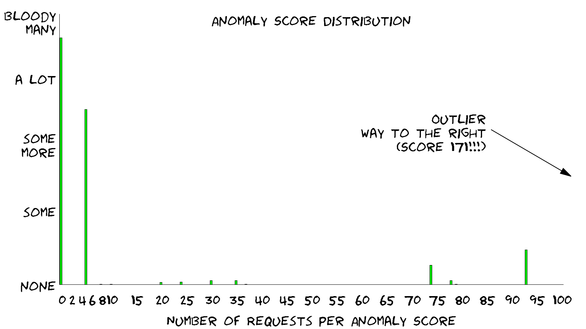

The character of the application, the paranoia level and the amount of traffic all influence the amount of false positives you get in your logs. In the first run, a couple of thousand or one hundred thousand requests max will do. Once you have that in your access log, it's time to take a look. Let's get an overview of the situation: Let's look at the example logs!

One would think that the error log with the alerts is the place to go. But, we are looking at the access log first. We defined the log format in a way that gives us the anomaly scores for every request. This helps us with this step.

In the previous tutorial, we used the script [modsec-positive-stats.rb](https://www.netnea.com/files/modsec-positive-stats.rb). We return to this script with the example access log as the target:

```
cat tutorial-8-example-access.log | alscores | modsec-positive-stats.rb
```{{execute}}

```
INCOMING                     Num of req. | % of req. |  Sum of % | Missing %
Number of incoming req. (total) |  10000 | 100.0000% | 100.0000% |   0.0000%

Empty or miss. incoming score   |      0 |   0.0000% |   0.0000% | 100.0000%
Reqs with incoming score of   0 |   5583 |  55.8300% |  55.8300% |  44.1700%
Reqs with incoming score of   1 |      0 |   0.0000% |  55.8300% |  44.1700%
Reqs with incoming score of   2 |      0 |   0.0000% |  55.8300% |  44.1700%
Reqs with incoming score of   3 |      0 |   0.0000% |  55.8300% |  44.1700%
Reqs with incoming score of   4 |      0 |   0.0000% |  55.8300% |  44.1700%
Reqs with incoming score of   5 |     30 |   0.3000% |  56.1300% |  43.8700%
Reqs with incoming score of   6 |      0 |   0.0000% |  56.1300% |  43.8700%
Reqs with incoming score of   7 |      0 |   0.0000% |  56.1300% |  43.8700%
Reqs with incoming score of   8 |      1 |   0.0100% |  56.1399% |  43.8601%
Reqs with incoming score of   9 |      0 |   0.0000% |  56.1399% |  43.8601%
Reqs with incoming score of  10 |   3194 |  31.9400% |  88.0800% |  11.9200%
Reqs with incoming score of  11 |      0 |   0.0000% |  88.0800% |  11.9200%
Reqs with incoming score of  12 |      0 |   0.0000% |  88.0800% |  11.9200%
Reqs with incoming score of  13 |      0 |   0.0000% |  88.0800% |  11.9200%
Reqs with incoming score of  14 |      0 |   0.0000% |  88.0800% |  11.9200%
Reqs with incoming score of  15 |      0 |   0.0000% |  88.0800% |  11.9200%
Reqs with incoming score of  16 |      0 |   0.0000% |  88.0800% |  11.9200%
Reqs with incoming score of  17 |      0 |   0.0000% |  88.0800% |  11.9200%
Reqs with incoming score of  18 |      0 |   0.0000% |  88.0800% |  11.9200%
Reqs with incoming score of  19 |      0 |   0.0000% |  88.0800% |  11.9200%
Reqs with incoming score of  20 |     56 |   0.5599% |  88.6400% |  11.3600%
Reqs with incoming score of  21 |      0 |   0.0000% |  88.6400% |  11.3600%
Reqs with incoming score of  22 |      0 |   0.0000% |  88.6400% |  11.3600%
Reqs with incoming score of  23 |      0 |   0.0000% |  88.6400% |  11.3600%
Reqs with incoming score of  24 |      0 |   0.0000% |  88.6400% |  11.3600%
Reqs with incoming score of  25 |      0 |   0.0000% |  88.6400% |  11.3600%
Reqs with incoming score of  26 |      0 |   0.0000% |  88.6400% |  11.3600%
Reqs with incoming score of  27 |      0 |   0.0000% |  88.6400% |  11.3600%
Reqs with incoming score of  28 |      0 |   0.0000% |  88.6400% |  11.3600%
Reqs with incoming score of  29 |      0 |   0.0000% |  88.6400% |  11.3600%
Reqs with incoming score of  30 |     77 |   0.7700% |  89.4100% |  10.5900%
Reqs with incoming score of  31 |      0 |   0.0000% |  89.4100% |  10.5900%
Reqs with incoming score of  32 |      0 |   0.0000% |  89.4100% |  10.5900%
Reqs with incoming score of  33 |      0 |   0.0000% |  89.4100% |  10.5900%
Reqs with incoming score of  34 |      0 |   0.0000% |  89.4100% |  10.5900%
Reqs with incoming score of  35 |     77 |   0.7700% |  90.1799% |   9.8201%
Reqs with incoming score of  36 |      0 |   0.0000% |  90.1799% |   9.8201%
Reqs with incoming score of  37 |      0 |   0.0000% |  90.1799% |   9.8201%
Reqs with incoming score of  38 |      0 |   0.0000% |  90.1799% |   9.8201%
Reqs with incoming score of  39 |      0 |   0.0000% |  90.1799% |   9.8201%
Reqs with incoming score of  40 |      0 |   0.0000% |  90.1799% |   9.8201%
Reqs with incoming score of  41 |      0 |   0.0000% |  90.1799% |   9.8201%
Reqs with incoming score of  42 |      0 |   0.0000% |  90.1799% |   9.8201%
Reqs with incoming score of  43 |      0 |   0.0000% |  90.1799% |   9.8201%
Reqs with incoming score of  44 |      0 |   0.0000% |  90.1799% |   9.8201%
Reqs with incoming score of  45 |      0 |   0.0000% |  90.1799% |   9.8201%
Reqs with incoming score of  46 |      0 |   0.0000% |  90.1799% |   9.8201%
Reqs with incoming score of  47 |      0 |   0.0000% |  90.1799% |   9.8201%
Reqs with incoming score of  48 |      0 |   0.0000% |  90.1799% |   9.8201%
Reqs with incoming score of  49 |      0 |   0.0000% |  90.1799% |   9.8201%
Reqs with incoming score of  50 |      0 |   0.0000% |  90.1799% |   9.8201%
Reqs with incoming score of  51 |      0 |   0.0000% |  90.1799% |   9.8201%
Reqs with incoming score of  52 |      0 |   0.0000% |  90.1799% |   9.8201%
Reqs with incoming score of  53 |      0 |   0.0000% |  90.1799% |   9.8201%
Reqs with incoming score of  54 |      0 |   0.0000% |  90.1799% |   9.8201%
Reqs with incoming score of  55 |      0 |   0.0000% |  90.1799% |   9.8201%
Reqs with incoming score of  56 |      0 |   0.0000% |  90.1799% |   9.8201%
Reqs with incoming score of  57 |      0 |   0.0000% |  90.1799% |   9.8201%
Reqs with incoming score of  58 |      0 |   0.0000% |  90.1799% |   9.8201%
Reqs with incoming score of  59 |      0 |   0.0000% |  90.1799% |   9.8201%
Reqs with incoming score of  60 |      0 |   0.0000% |  90.1799% |   9.8201%
Reqs with incoming score of  61 |      0 |   0.0000% |  90.1799% |   9.8201%
Reqs with incoming score of  62 |      0 |   0.0000% |  90.1799% |   9.8201%
Reqs with incoming score of  63 |      0 |   0.0000% |  90.1799% |   9.8201%
Reqs with incoming score of  64 |      0 |   0.0000% |  90.1799% |   9.8201%
Reqs with incoming score of  65 |      0 |   0.0000% |  90.1799% |   9.8201%
Reqs with incoming score of  66 |      0 |   0.0000% |  90.1799% |   9.8201%
Reqs with incoming score of  67 |      0 |   0.0000% |  90.1799% |   9.8201%
Reqs with incoming score of  68 |      0 |   0.0000% |  90.1799% |   9.8201%
Reqs with incoming score of  69 |      0 |   0.0000% |  90.1799% |   9.8201%
Reqs with incoming score of  70 |      0 |   0.0000% |  90.1799% |   9.8201%
Reqs with incoming score of  71 |      0 |   0.0000% |  90.1799% |   9.8201%
Reqs with incoming score of  72 |      0 |   0.0000% |  90.1799% |   9.8201%
Reqs with incoming score of  73 |      0 |   0.0000% |  90.1799% |   9.8201%
Reqs with incoming score of  74 |      0 |   0.0000% |  90.1799% |   9.8201%
Reqs with incoming score of  75 |      0 |   0.0000% |  90.1799% |   9.8201%
Reqs with incoming score of  76 |      0 |   0.0000% |  90.1799% |   9.8201%
Reqs with incoming score of  77 |      0 |   0.0000% |  90.1799% |   9.8201%
Reqs with incoming score of  78 |     77 |   0.7700% |  90.9499% |   9.0501%
Reqs with incoming score of  79 |    449 |   4.4900% |  95.4399% |   4.5601%
Reqs with incoming score of  80 |      0 |   0.0000% |  95.4399% |   4.5601%
Reqs with incoming score of  81 |      0 |   0.0000% |  95.4399% |   4.5601%
Reqs with incoming score of  82 |      0 |   0.0000% |  95.4399% |   4.5601%
Reqs with incoming score of  83 |      0 |   0.0000% |  95.4399% |   4.5601%
Reqs with incoming score of  84 |      0 |   0.0000% |  95.4399% |   4.5601%
Reqs with incoming score of  85 |      0 |   0.0000% |  95.4399% |   4.5601%
Reqs with incoming score of  86 |      0 |   0.0000% |  95.4399% |   4.5601%
Reqs with incoming score of  87 |      0 |   0.0000% |  95.4399% |   4.5601%
Reqs with incoming score of  88 |      0 |   0.0000% |  95.4399% |   4.5601%
Reqs with incoming score of  89 |      0 |   0.0000% |  95.4399% |   4.5601%
Reqs with incoming score of  90 |      0 |   0.0000% |  95.4399% |   4.5601%
Reqs with incoming score of  91 |      0 |   0.0000% |  95.4399% |   4.5601%
Reqs with incoming score of  92 |      0 |   0.0000% |  95.4399% |   4.5601%
Reqs with incoming score of  93 |      1 |   0.0100% |  95.4499% |   4.5501%
Reqs with incoming score of  94 |      0 |   0.0000% |  95.4499% |   4.5501%
Reqs with incoming score of  95 |      0 |   0.0000% |  95.4499% |   4.5501%
Reqs with incoming score of  96 |      0 |   0.0000% |  95.4499% |   4.5501%
Reqs with incoming score of  97 |      0 |   0.0000% |  95.4499% |   4.5501%
Reqs with incoming score of  98 |    448 |   4.4799% |  99.9299% |   0.0701%
Reqs with incoming score of  99 |      0 |   0.0000% |  99.9299% |   0.0701%
Reqs with incoming score of 100 |      0 |   0.0000% |  99.9299% |   0.0701%
Reqs with incoming score of 101 |      0 |   0.0000% |  99.9299% |   0.0701%
Reqs with incoming score of 102 |      0 |   0.0000% |  99.9299% |   0.0701%
Reqs with incoming score of 103 |      0 |   0.0000% |  99.9299% |   0.0701%
Reqs with incoming score of 104 |      0 |   0.0000% |  99.9299% |   0.0701%
Reqs with incoming score of 105 |      0 |   0.0000% |  99.9299% |   0.0701%
Reqs with incoming score of 106 |      0 |   0.0000% |  99.9299% |   0.0701%
Reqs with incoming score of 107 |      0 |   0.0000% |  99.9299% |   0.0701%
Reqs with incoming score of 108 |      0 |   0.0000% |  99.9299% |   0.0701%
Reqs with incoming score of 109 |      0 |   0.0000% |  99.9299% |   0.0701%
Reqs with incoming score of 110 |      0 |   0.0000% |  99.9299% |   0.0701%
Reqs with incoming score of 111 |      0 |   0.0000% |  99.9299% |   0.0701%
Reqs with incoming score of 112 |      0 |   0.0000% |  99.9299% |   0.0701%
Reqs with incoming score of 113 |      0 |   0.0000% |  99.9299% |   0.0701%
Reqs with incoming score of 114 |      0 |   0.0000% |  99.9299% |   0.0701%
Reqs with incoming score of 115 |      0 |   0.0000% |  99.9299% |   0.0701%
Reqs with incoming score of 116 |      0 |   0.0000% |  99.9299% |   0.0701%
Reqs with incoming score of 117 |      0 |   0.0000% |  99.9299% |   0.0701%
Reqs with incoming score of 118 |      0 |   0.0000% |  99.9299% |   0.0701%
Reqs with incoming score of 119 |      0 |   0.0000% |  99.9299% |   0.0701%
Reqs with incoming score of 120 |      0 |   0.0000% |  99.9299% |   0.0701%
Reqs with incoming score of 121 |      0 |   0.0000% |  99.9299% |   0.0701%
Reqs with incoming score of 122 |      0 |   0.0000% |  99.9299% |   0.0701%
Reqs with incoming score of 123 |      0 |   0.0000% |  99.9299% |   0.0701%
Reqs with incoming score of 124 |      0 |   0.0000% |  99.9299% |   0.0701%
Reqs with incoming score of 125 |      0 |   0.0000% |  99.9299% |   0.0701%
Reqs with incoming score of 126 |      0 |   0.0000% |  99.9299% |   0.0701%
Reqs with incoming score of 127 |      0 |   0.0000% |  99.9299% |   0.0701%
Reqs with incoming score of 128 |      0 |   0.0000% |  99.9299% |   0.0701%
Reqs with incoming score of 129 |      0 |   0.0000% |  99.9299% |   0.0701%
Reqs with incoming score of 130 |      0 |   0.0000% |  99.9299% |   0.0701%
Reqs with incoming score of 131 |      0 |   0.0000% |  99.9299% |   0.0701%
Reqs with incoming score of 132 |      0 |   0.0000% |  99.9299% |   0.0701%
Reqs with incoming score of 133 |      0 |   0.0000% |  99.9299% |   0.0701%
Reqs with incoming score of 134 |      0 |   0.0000% |  99.9299% |   0.0701%
Reqs with incoming score of 135 |      0 |   0.0000% |  99.9299% |   0.0701%
Reqs with incoming score of 136 |      0 |   0.0000% |  99.9299% |   0.0701%
Reqs with incoming score of 137 |      0 |   0.0000% |  99.9299% |   0.0701%
Reqs with incoming score of 138 |      0 |   0.0000% |  99.9299% |   0.0701%
Reqs with incoming score of 139 |      0 |   0.0000% |  99.9299% |   0.0701%
Reqs with incoming score of 140 |      0 |   0.0000% |  99.9299% |   0.0701%
Reqs with incoming score of 141 |      0 |   0.0000% |  99.9299% |   0.0701%
Reqs with incoming score of 142 |      0 |   0.0000% |  99.9299% |   0.0701%
Reqs with incoming score of 143 |      0 |   0.0000% |  99.9299% |   0.0701%
Reqs with incoming score of 144 |      0 |   0.0000% |  99.9299% |   0.0701%
Reqs with incoming score of 145 |      0 |   0.0000% |  99.9299% |   0.0701%
Reqs with incoming score of 146 |      0 |   0.0000% |  99.9299% |   0.0701%
Reqs with incoming score of 147 |      0 |   0.0000% |  99.9299% |   0.0701%
Reqs with incoming score of 148 |      0 |   0.0000% |  99.9299% |   0.0701%
Reqs with incoming score of 149 |      0 |   0.0000% |  99.9299% |   0.0701%
Reqs with incoming score of 150 |      0 |   0.0000% |  99.9299% |   0.0701%
Reqs with incoming score of 151 |      0 |   0.0000% |  99.9299% |   0.0701%
Reqs with incoming score of 152 |      0 |   0.0000% |  99.9299% |   0.0701%
Reqs with incoming score of 153 |      0 |   0.0000% |  99.9299% |   0.0701%
Reqs with incoming score of 154 |      0 |   0.0000% |  99.9299% |   0.0701%
Reqs with incoming score of 155 |      0 |   0.0000% |  99.9299% |   0.0701%
Reqs with incoming score of 156 |      0 |   0.0000% |  99.9299% |   0.0701%
Reqs with incoming score of 157 |      0 |   0.0000% |  99.9299% |   0.0701%
Reqs with incoming score of 158 |      0 |   0.0000% |  99.9299% |   0.0701%
Reqs with incoming score of 159 |      0 |   0.0000% |  99.9299% |   0.0701%
Reqs with incoming score of 160 |      0 |   0.0000% |  99.9299% |   0.0701%
Reqs with incoming score of 161 |      0 |   0.0000% |  99.9299% |   0.0701%
Reqs with incoming score of 162 |      0 |   0.0000% |  99.9299% |   0.0701%
Reqs with incoming score of 163 |      0 |   0.0000% |  99.9299% |   0.0701%
Reqs with incoming score of 164 |      0 |   0.0000% |  99.9299% |   0.0701%
Reqs with incoming score of 165 |      0 |   0.0000% |  99.9299% |   0.0701%
Reqs with incoming score of 166 |      0 |   0.0000% |  99.9299% |   0.0701%
Reqs with incoming score of 167 |      0 |   0.0000% |  99.9299% |   0.0701%
Reqs with incoming score of 168 |      0 |   0.0000% |  99.9299% |   0.0701%
Reqs with incoming score of 169 |      0 |   0.0000% |  99.9299% |   0.0701%
Reqs with incoming score of 170 |      0 |   0.0000% |  99.9299% |   0.0701%
Reqs with incoming score of 171 |      0 |   0.0000% |  99.9299% |   0.0701%
Reqs with incoming score of 172 |      0 |   0.0000% |  99.9299% |   0.0701%
Reqs with incoming score of 173 |      0 |   0.0000% |  99.9299% |   0.0701%
Reqs with incoming score of 174 |      0 |   0.0000% |  99.9299% |   0.0701%
Reqs with incoming score of 175 |      0 |   0.0000% |  99.9299% |   0.0701%
Reqs with incoming score of 176 |      0 |   0.0000% |  99.9299% |   0.0701%
Reqs with incoming score of 177 |      0 |   0.0000% |  99.9299% |   0.0701%
Reqs with incoming score of 178 |      0 |   0.0000% |  99.9299% |   0.0701%
Reqs with incoming score of 179 |      0 |   0.0000% |  99.9299% |   0.0701%
Reqs with incoming score of 180 |      0 |   0.0000% |  99.9299% |   0.0701%
Reqs with incoming score of 181 |      0 |   0.0000% |  99.9299% |   0.0701%
Reqs with incoming score of 182 |      0 |   0.0000% |  99.9299% |   0.0701%
Reqs with incoming score of 183 |      0 |   0.0000% |  99.9299% |   0.0701%
Reqs with incoming score of 184 |      0 |   0.0000% |  99.9299% |   0.0701%
Reqs with incoming score of 185 |      0 |   0.0000% |  99.9299% |   0.0701%
Reqs with incoming score of 186 |      0 |   0.0000% |  99.9299% |   0.0701%
Reqs with incoming score of 187 |      0 |   0.0000% |  99.9299% |   0.0701%
Reqs with incoming score of 188 |      0 |   0.0000% |  99.9299% |   0.0701%
Reqs with incoming score of 189 |      1 |   0.0100% |  99.9400% |   0.0600%
Reqs with incoming score of 190 |      0 |   0.0000% |  99.9400% |   0.0600%
Reqs with incoming score of 191 |      0 |   0.0000% |  99.9400% |   0.0600%
Reqs with incoming score of 192 |      0 |   0.0000% |  99.9400% |   0.0600%
Reqs with incoming score of 193 |      0 |   0.0000% |  99.9400% |   0.0600%
Reqs with incoming score of 194 |      0 |   0.0000% |  99.9400% |   0.0600%
Reqs with incoming score of 195 |      0 |   0.0000% |  99.9400% |   0.0600%
Reqs with incoming score of 196 |      0 |   0.0000% |  99.9400% |   0.0600%
Reqs with incoming score of 197 |      0 |   0.0000% |  99.9400% |   0.0600%
Reqs with incoming score of 198 |      0 |   0.0000% |  99.9400% |   0.0600%
Reqs with incoming score of 199 |      0 |   0.0000% |  99.9400% |   0.0600%
Reqs with incoming score of 200 |      0 |   0.0000% |  99.9400% |   0.0600%
Reqs with incoming score of 201 |      0 |   0.0000% |  99.9400% |   0.0600%
Reqs with incoming score of 202 |      0 |   0.0000% |  99.9400% |   0.0600%
Reqs with incoming score of 203 |      0 |   0.0000% |  99.9400% |   0.0600%
Reqs with incoming score of 204 |      0 |   0.0000% |  99.9400% |   0.0600%
Reqs with incoming score of 205 |      0 |   0.0000% |  99.9400% |   0.0600%
Reqs with incoming score of 206 |      0 |   0.0000% |  99.9400% |   0.0600%
Reqs with incoming score of 207 |      0 |   0.0000% |  99.9400% |   0.0600%
Reqs with incoming score of 208 |      0 |   0.0000% |  99.9400% |   0.0600%
Reqs with incoming score of 209 |      0 |   0.0000% |  99.9400% |   0.0600%
Reqs with incoming score of 210 |      0 |   0.0000% |  99.9400% |   0.0600%
Reqs with incoming score of 211 |      0 |   0.0000% |  99.9400% |   0.0600%
Reqs with incoming score of 212 |      0 |   0.0000% |  99.9400% |   0.0600%
Reqs with incoming score of 213 |      0 |   0.0000% |  99.9400% |   0.0600%
Reqs with incoming score of 214 |      0 |   0.0000% |  99.9400% |   0.0600%
Reqs with incoming score of 215 |      0 |   0.0000% |  99.9400% |   0.0600%
Reqs with incoming score of 216 |      0 |   0.0000% |  99.9400% |   0.0600%
Reqs with incoming score of 217 |      0 |   0.0000% |  99.9400% |   0.0600%
Reqs with incoming score of 218 |      0 |   0.0000% |  99.9400% |   0.0600%
Reqs with incoming score of 219 |      0 |   0.0000% |  99.9400% |   0.0600%
Reqs with incoming score of 220 |      0 |   0.0000% |  99.9400% |   0.0600%
Reqs with incoming score of 221 |      0 |   0.0000% |  99.9400% |   0.0600%
Reqs with incoming score of 222 |      0 |   0.0000% |  99.9400% |   0.0600%
Reqs with incoming score of 223 |      0 |   0.0000% |  99.9400% |   0.0600%
Reqs with incoming score of 224 |      0 |   0.0000% |  99.9400% |   0.0600%
Reqs with incoming score of 225 |      0 |   0.0000% |  99.9400% |   0.0600%
Reqs with incoming score of 226 |      0 |   0.0000% |  99.9400% |   0.0600%
Reqs with incoming score of 227 |      0 |   0.0000% |  99.9400% |   0.0600%
Reqs with incoming score of 228 |      0 |   0.0000% |  99.9400% |   0.0600%
Reqs with incoming score of 229 |      0 |   0.0000% |  99.9400% |   0.0600%
Reqs with incoming score of 230 |      0 |   0.0000% |  99.9400% |   0.0600%
Reqs with incoming score of 231 |      6 |   0.0600% | 100.0000% |   0.0000%

Incoming average:  12.5272    Median   0.0000    Standard deviation  26.2197


OUTGOING                     Num of req. | % of req. |  Sum of % | Missing %
Number of outgoing req. (total) |  10000 | 100.0000% | 100.0000% |   0.0000%

Empty or miss. outgoing score   |      0 |   0.0000% |   0.0000% | 100.0000%
Reqs with outgoing score of   0 |  10000 | 100.0000% | 100.0000% |   0.0000%

Outgoing average:   0.0000    Median   0.0000    Standard deviation   0.0000
```

So we have 10,000 requests and about half of them pass without raising any alarm. Over 3,000 requests come in with an anomaly score of 10 and of the remaining requests form two distinct anomaly score clusters around 79 and 98. Then there is a very long tail with the highest group of requests scoring 231. That's more than 40 critical alerts on a single request (a critical alert gives 5 points, 40 critical alerts will thus score 200). Wow.

Let's visualize this:



_A quick overview over the stats generated above_


This is only a graph cobbled together on the quick. But it shows the problem that most requests are located near the left. They did not score at all, or they scored exactly 10 points. But there requests with higher scores and there is even a handful of outliers very far on the right outside the frame. So where do we start? 

We start with the request returning the highest anomaly score, we start on the right side of the graph! This makes sense because we are in blocking mode and we would like to reduce the threshold. The group of requests standing in our way are the six requests with a score of 231 and the single request with a score of 189. Let's write rule exclusions to suppress the alarms leading to these scores.
